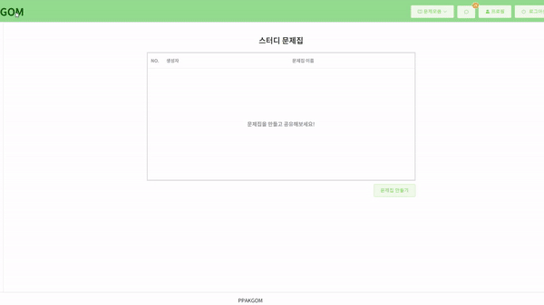

# README

# <프로젝트 소개>

## [비대면 화상 회의 & 스터디 플랫폼 "PPAKGOM"]

### :bulb: 관심사 검색을 통해 원하는 스터디를 빠르게 찾고 스터디원 평가를 통해 열정적인 스터디원과 함께 하는 화상회의 스터디 플랫폼

##### 진행 기간 : 2021.07.12 ~ 2021.08.20

##### 목표

- 코로나로 인해 오프라인 스터디가 힘든 지금, 온라인으로 스터디를 지원합니다.
- 관심분야를 통해 스터디, 스터디원을 찾을 수 있고 열정도를 보면서 좋은 팀원과 함께 할 수 있습니다.
- 공부나 관심 분야 공유를 하고 싶은 사람들 누구나 이용할 수 있고 특히, 취업 준비생의 취뽀를 응원합니다🙂

### :heavy_check_mark: 주요 기능

**스터디 검색**


**스터디 생성**


**스터디 가입**


**스터디 일정&출석**


**스터디 찜하기**


**스터디 초대**


**스터디원 평가**


**문제집 생성**



**문제풀기&결과**


**화상미팅**


<br>

### 🎈 기획

##### API 명세서

- https://confusion-hovercraft-efe.notion.site/29466b85a3c34d4cbf8a2c8a5c8bb4b9?v=14ace7cd5f1549bf924ba899610ac7ef

##### 와이어 프레임

- https://confusion-hovercraft-efe.notion.site/c905a398dbb043faab420e725292e31b

**데이터베이스**


<br>

### 🎨 아키텍쳐


<br>

### :gear: 개발 환경

#### Frontend

- node v14.17.2
  - https://nodejs.org/es/blog/release/v14.17.2/
- npm 6.14.13
  - https://www.npmjs.com/package/npm/v/6.14.13
- @vue/cli 4.5.13
  - https://www.npmjs.com/package/@vue/cli/v/4.5.13
- VScode Extensions
  - Vetur - Pine Wu
  - EditorConfig for VS Code
  - Vue
  - Vue VSCode Snippets - sarah.drasner

**Project setup**

```plaintext
npm install
```

**Compiles and hot-reloads for development**

```plaintext
npm run serve
```

**Compiles and minifies for production**

```plaintext
npm run build
```

#### Backend

- Java jdk 1.8

  - https://www.eclipse.org/downloads/download.php?file=/technology/epp/downloads/release/2018-09/R/eclipse-jee-2018-09-win32-x86_64.zip

- Gradle

  - https://services.gradle.org/distributions/ -> gradle-6.7-bin.zip

- MySQL 8.0.23
- full distribution on Eclipse 4.15
  - https://github.com/spring-projects/toolsuite-distribution/wiki/Spring-Tool-Suite-3
  - STS 3.9.14.RELEASE
  - 디펜던시 : Spring Boot DevTools, Lombok,MySQL Driver, QueryDSL, Stomp-WebSocket, Spring Security, JPA, Mail

<br>

# 배포

## nginx

## Openvidu deployment

## Openvidu 서버 배포

> openvidu on promises 방식으로 배포
>
> 이 방식은 low-level에 속하는 서버 설정(openvidu server, kurento media server, coturn, redis, nginx 등의 서버를 도커 컨테이너만 가져와서 별도로 추가 설정 없이 사용할 수 있게 하는 것)
>
> docker-compose를 이용해 위 서버들이 실행되는 도커 컨테이너들을 통합 관리
>
> 기본적으로 아래 설정들은 ubuntu 환경에서 실행됨

- 적용하면서 특이했던 사항
  기존의 kurento coturn과 충돌이 발생해 애를 많이 먹었다.

- Docker 설치

- Docker-Compose 설치


- 보안그룹 인바운드 설정

 

- Deployment

